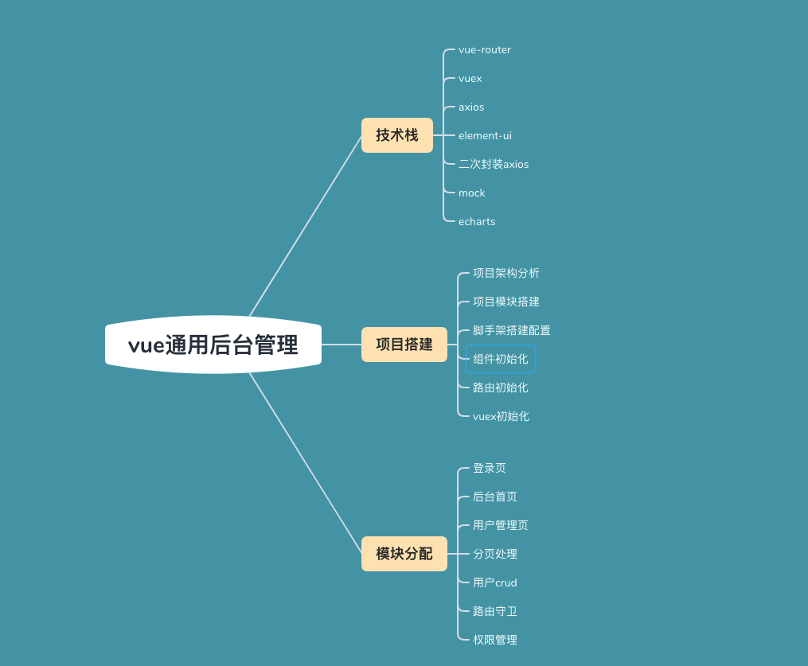

# 通用项目管理后台，vue-manage



使用到的库：
```json
"dependencies": {
    "axios": "^0.26.1",
    "core-js": "^3.8.3",
    "echarts": "^5.3.1",
    "element-ui": "^2.15.6",
    "js-cookie": "^3.0.1",
    "less": "^4.1.2",
    "less-loader": "^10.2.0",
    "mockjs": "^1.1.0",
    "vue": "^2.6.14",
    "vue-router": "^3.5.3",
    "vuex": "^3.6.2"
  },
```

## 模块划分
1. 登陆模块
2. 首页（侧边栏、Header面包屑和echart）
3. 用户管理模块

### 功能点

#### 登陆模块

在登陆时模拟一个token来存储到cookie中，并通过导航守卫根据token进行路由的跳转，另外还根据登陆角色的不同来进行动态路由的加载。

```js
// 导航守卫
router.beforeEach((to, from, next) => {
  store.commit('getToken')
  const token = store.state.user.token
  if (!token && to.name !== 'login') {
    next({ name: 'login' })
  } else if (token && to.name === 'login') {
    next({ name: 'home' })
  } else {
    next()
  }
})

// 登陆跳转
if (res.code === 20000) {
          this.$store.commit("cleanMenu");
          this.$store.commit("setMenu", res.data.menu);
          this.$store.commit("setToken", res.data.token);
          this.$store.commit('addMenu', this.$router)
          this.$router.push({ name: 'home'})
        } else {
          this.$message.warning(res.data.message);
        }

// 登出
logout() {
        this.$store.commit('clearToken')
        this.$store.commit('clearMenu')
        this.$router.push('/login')
      }

// 动态加载路由
addMenu(state, router) {
            if (!Cookie.get('menu')) {
                return
            }
            const menu = JSON.parse(Cookie.get('menu'))
            state.menu = menu
            const menuArray = []
            menu.forEach(item => {
                if (item.children) {
                    item.children = item.children.map(item => {
                        item.component = () => import(`../views/${item.url}`)
                        return item
                    })
                    menuArray.push(...item.children)
                } else {
                    item.component = () => import(`../views/${item.url}`)
                    menuArray.push(item)
                }
            });
            console.log(menuArray,'menuArray')
            // 路由的动态添加
            menuArray.forEach(item => {
                router.addRoute('MainView', item)
            })
        }
```

#### 首页
包含：
- 侧边栏
- 头部区域
- 标签区域
- 主体区域

侧边栏的展开和最小化涉及兄弟组件间的通信，项目使用vuex来实现状态管理
```jss
// 总共有两个模块
export default new Vuex.Store({
    modules: {
        tab,
        user,
    }
})
```
每个模块下用state存储状态，使用mutations修改状态

#### 面包屑实现
面包屑是在head部分组件里,Tag标签虽然不再head部分组件里,但是它在整个管理后台系统中是会一直存在的，所以需要在Main.vue中。

这两块功能的实现,主要依赖Element-ui两个样式 Breadcrumb 面包屑 + Tag 标签


整个大致逻辑是这样的,首先是面包屑首页一定要存在的,接下来在侧边组件点击某菜单,把tabsList存到vuex中，在Tag中点击或关闭标签会对tabsList数组进行增加或删除路由对象元素，然后在头部组件来获取vuex中这个数据并展示。

#### 封装通用组件
- CommonAside
- CommonEcharts
- CommonForm
- CommonHeader
- CommonTable
- CommonTag

#### Mockjs
使用mockjs库拦截规定好的axios请求，生成预定数据并返回来模拟后端接口请求

```js
// rurl-拦截地址：使用字符串或正则
// rtype-拦截的请求类型：字符串、小写
Mock.mock('/home/getData', homeApi.getStatisticalData)
Mock.mock(/user\/add/, 'post', userApi.createUser)
Mock.mock(/user\/edit/, 'post', userApi.updateUser)

Mock.mock(/user\/getUser/, 'get', userApi.getUserList)
Mock.mock(/user\/delUser/, 'get', userApi.deleteUser)

Mock.mock(/permission\/getMenu/, 'post', permissionApi.getMenu)
```